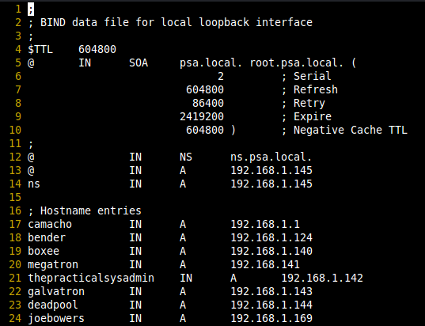

<h1 align="center">BIND9 — Full DNS Configuration Guide</h1>

<p align="center">
Panduan lengkap konfigurasi BIND9 dari instalasi, zone file, SOA, NS, subdomain, hingga reverse DNS.
</p>

<p align="center">


</p>

---

## 📦 Instalasi BIND9

```bash
sudo apt update && sudo apt install -y bind9 bind9utils bind9-doc dnsutils
```

Cek status setelah instalasi:

```bash
sudo systemctl status bind9
sudo systemctl enable bind9
```

---

## 📁 Struktur Direktori BIND9

```text
/etc/bind/
├── named.conf                  # File utama — include semua config
├── named.conf.options          # Global options (forwarders, dll)
├── named.conf.local            # Deklarasi zone kita
├── named.conf.default-zones    # Zone default bawaan sistem
└── zones/
    ├── db.example.com          # Zone file forward (A, CNAME, MX, dll)
    └── db.10.168.192           # Zone file reverse (PTR)
```

---

## ⚙️ Konfigurasi `named.conf.options`

File: `/etc/bind/named.conf.options`

```conf
options {
    directory "/var/cache/bind";

    // Forwarder ke DNS publik kalau tidak ada di zone lokal
    forwarders {
        8.8.8.8;
        8.8.4.4;
        1.1.1.1;
    };

    dnssec-validation auto;

    // Izinkan query dari semua (ubah sesuai kebutuhan)
    allow-query { any; };

    // Izinkan rekursi dari lokal saja (keamanan)
    allow-recursion { 127.0.0.1; 192.168.0.0/16; };

    listen-on { any; };
    listen-on-v6 { any; };
};
```

---

## 📋 Deklarasi Zone — `named.conf.local`

File: `/etc/bind/named.conf.local`

```conf
// ── Forward Zone ──────────────────────────────────────────
zone "example.com" {
    type master;
    file "/etc/bind/zones/db.example.com";
    allow-transfer { none; };   // Ganti IP slave jika ada secondary DNS
};

// ── Reverse Zone (sesuaikan dengan subnet kamu) ───────────
zone "1.168.192.in-addr.arpa" {
    type master;
    file "/etc/bind/zones/db.192.168.1";
    allow-transfer { none; };
};
```

> 📝 Buat folder zones dulu jika belum ada:
> ```bash
> sudo mkdir -p /etc/bind/zones
> ```

---

## 🗂️ Zone File Forward — `db.example.com`

File: `/etc/bind/zones/db.example.com`

```dns
; ============================================================
; Zone File: example.com
; ============================================================

$TTL 3600       ; Default TTL — 1 jam

; ── SOA Record ───────────────────────────────────────────────
@   IN  SOA     ns1.example.com. admin.example.com. (
                2024010101  ; Serial   ← WAJIB diupdate setiap ada perubahan
                3600        ; Refresh  — slave cek update tiap 1 jam
                1800        ; Retry    — retry jika gagal tiap 30 menit
                604800      ; Expire   — hapus zone di slave setelah 7 hari
                86400       ; Negative TTL — cache NXDOMAIN selama 1 hari
                )

; ── NS Records ───────────────────────────────────────────────
@               IN  NS      ns1.example.com.
@               IN  NS      ns2.example.com.

; ── A Records — IP Server ────────────────────────────────────
@               IN  A       203.0.113.10    ; Root domain → IP server
ns1             IN  A       203.0.113.10    ; Primary nameserver
ns2             IN  A       203.0.113.11    ; Secondary nameserver

; ── Subdomain A Records ──────────────────────────────────────
www             IN  A       203.0.113.10
mail            IN  A       203.0.113.10
vpn             IN  A       203.0.113.10
acs             IN  A       203.0.113.10
monitoring      IN  A       203.0.113.10
panel           IN  A       203.0.113.10

; ── CNAME Records (alias) ────────────────────────────────────
ftp             IN  CNAME   www.example.com.
blog            IN  CNAME   www.example.com.

; ── MX Records (Email) ───────────────────────────────────────
@               IN  MX  10  mail.example.com.

; ── TXT Records ──────────────────────────────────────────────
@               IN  TXT     "v=spf1 mx ~all"
```

---

## ⚠️ Serial Number — Wajib Diupdate Setiap Ada Perubahan

> Serial dipakai BIND9 untuk memberitahu slave DNS bahwa zone sudah berubah.
> Jika serial **tidak diupdate**, perubahan **tidak akan propagate** ke secondary DNS.

### Format Serial yang Direkomendasikan

```
YYYYMMDDNN

YYYY = Tahun   (2024)
MM   = Bulan   (01)
DD   = Tanggal (15)
NN   = Nomor urut hari itu (01, 02, 03...)
```

### Contoh

| Situasi | Serial |
|---------|--------|
| Pertama kali setup tanggal 1 Jan 2024 | `2024010101` |
| Update kedua di hari yang sama | `2024010102` |
| Update keesokan harinya | `2024010201` |
| Update lagi tanggal 15 Jan 2024 | `2024011501` |

### Cara Cepat Generate Serial

```bash
# Generate serial format YYYYMMDDNN otomatis
date +%Y%m%d01
```

---

## 🔁 Zone File Reverse — `db.192.168.1`

File: `/etc/bind/zones/db.192.168.1`

```dns
; ============================================================
; Reverse Zone File: 192.168.1.x
; ============================================================

$TTL 3600

@   IN  SOA     ns1.example.com. admin.example.com. (
                2024010101  ; Serial ← update jika ada perubahan
                3600
                1800
                604800
                86400
                )

; ── NS Records ───────────────────────────────────────────────
@               IN  NS      ns1.example.com.

; ── PTR Records (IP → Hostname) ──────────────────────────────
10              IN  PTR     ns1.example.com.
11              IN  PTR     ns2.example.com.
20              IN  PTR     www.example.com.
21              IN  PTR     mail.example.com.
```

> 📝 Format PTR: oktet terakhir IP saja. Contoh: `192.168.1.10` → tulis `10`

---

## ✅ Validasi Konfigurasi

Selalu jalankan perintah ini setelah edit apapun sebelum reload:

```bash
# Cek syntax named.conf
sudo named-checkconf

# Cek zone file forward
sudo named-checkzone example.com /etc/bind/zones/db.example.com

# Cek zone file reverse
sudo named-checkzone 1.168.192.in-addr.arpa /etc/bind/zones/db.192.168.1
```

Output yang benar:

```
zone example.com/IN: loaded serial 2024010101
OK
```

---

## 🔄 Reload & Restart BIND9

```bash
# Reload zone saja (tanpa restart full) — lebih aman
sudo rndc reload

# Atau reload zone spesifik
sudo rndc reload example.com

# Restart penuh jika ada perubahan named.conf
sudo systemctl restart bind9

# Cek log error
sudo journalctl -u bind9 -n 50 --no-pager
```

---

## 🧪 Testing DNS

```bash
# Query A record
dig @localhost example.com A

# Query NS record
dig @localhost example.com NS

# Query subdomain
dig @localhost www.example.com A
dig @localhost mail.example.com A

# Query MX record
dig @localhost example.com MX

# Reverse lookup (PTR)
dig @localhost -x 203.0.113.10

# Cek propagasi dari luar
nslookup example.com 8.8.8.8
```

---

## 📋 Checklist Setiap Kali Edit Zone File

```
[ ] Edit zone file (db.example.com atau db.192.168.1)
[ ] Update nilai Serial (format YYYYMMDDNN)
[ ] Jalankan named-checkzone untuk validasi
[ ] Jalankan rndc reload untuk apply perubahan
[ ] Test dengan dig atau nslookup
```

---

## 🚫 Kesalahan Umum

| Kesalahan | Akibat | Solusi |
|-----------|--------|--------|
| Lupa update serial | Zone tidak propagate ke slave | Update serial, reload |
| Titik (`.`) di akhir FQDN hilang | DNS resolve ke domain salah | Tambahkan `.` di akhir FQDN |
| Spasi vs Tab tidak konsisten | Zone file error saat load | Gunakan tab untuk indentasi |
| Lupa `named-checkzone` sebelum reload | BIND9 bisa gagal load zone | Selalu validasi dulu |
| IP di PTR tidak sinkron dengan A record | Reverse lookup gagal | Samakan IP di kedua zone file |

---

#### Example Result ".db" config


<div>
   <p align="center">
        
    </p>

</div>

---

<div align="center">
  <p>Made by Alfannite for you hehe 😊</p>

  <a href="https://github.com/alfannite">
    
  </a>
  <a href="https://threads.net/@yeofanya">
    
  </a>
  <a href="https://instagram.com/alfan.niteops">
    
  </a>
  <a href="https://t.me/fannite_ops">
    
  </a>
  <a href="https://www.twitch.tv/fannitee">
    
  </a>
  <a href="https://discord.gg/mS4UXkQjW">
    
  </a>
</div>