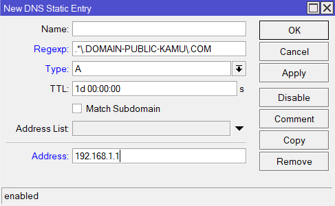

<h1 align="center">Guide Setting DNS di MikroTik </h1>

Guide cara setting static DNS on mikroitk terutama pakai **Regexp**

---

### Configuration

Lihat pada Gambar di bawah ini

**Notes!!! Parameter Address di pointing kan ke IP Address server Proxy kamu**

---

  
Made by Alfannite for you hehe 😊 

  
  
  
  
  
  

